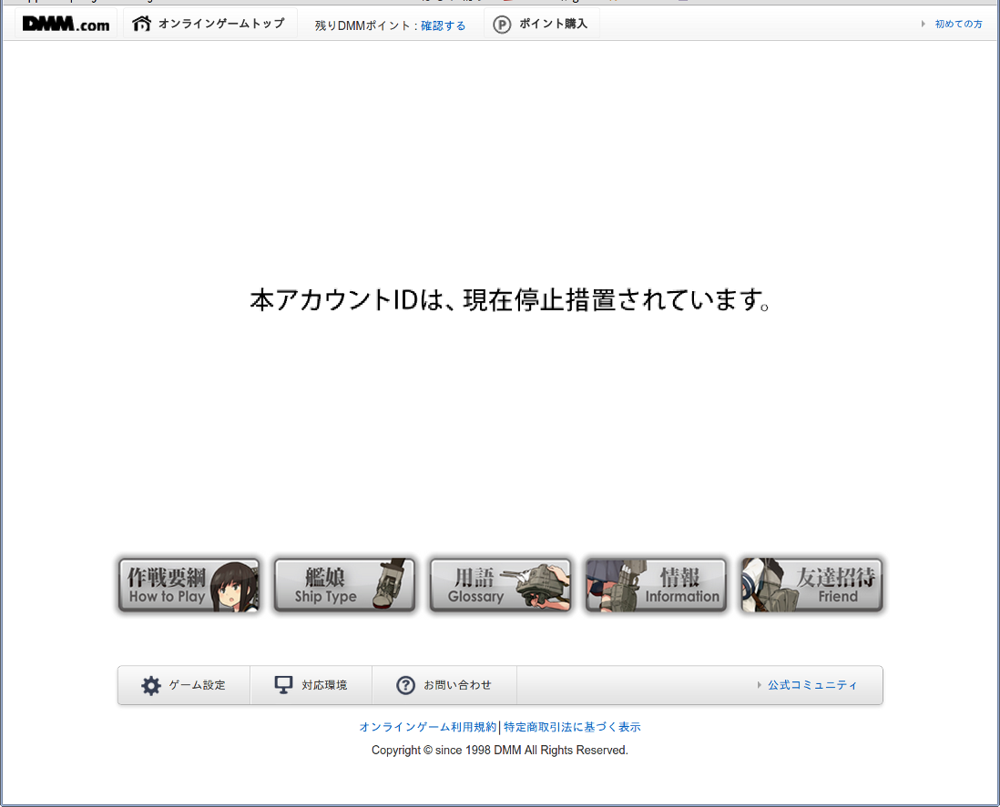

# ログイン

この章では艦これにログインするまでのやりとりを解説します。

## DMMにアクセスしてアプリを起動する

ゲームを始めるために、DMMにアクセスして艦これを起動します。

DMMのオンラインゲームは、他の多くのSNS上のソーシャルゲームと同様に、
DMMが用意する共通レイアウトの中に、ゲームプロバイダから指定された `gadget.xml` というファイルの内容に従って、`iframe` でゲーム本体を読み込む仕組みになっています。

DMMの内部では、アプリのキーやシークレットと共に、`gadget.xml` へのURLが登録されていると推測されます。
アプリ起動に必要な情報は全てDMMが持っているので、簡単に攻撃はできません。

### アプリ起動中に攻撃できる人

艦これの `gadget.xml` は、httpで配信されています。
`gadget.xml` にアクセスするクライアントは**DMMサーバ**なので、httpでも外部からの攻撃には耐性があります。
ただし、DMMのサーバと艦これのサーバを繋ぐ**経路上にいる機器**を攻撃できた場合、
ニセの `gadget.xml` を配信することができるので**Man in the Middle 攻撃**(以下**MitM攻撃**)が成立します。
プロバイダの中の人とかじゃないとできないと思います。

## 艦これサーバにユーザ認証

`iframe` に艦これ本体が読み込まれると、艦これサーバへログイン認証が行われます。
まずjavascriptでDMMサーバにアクセスしているユーザの情報を取りに行きます。
DMMのユーザIDが取得できると、艦これサーバに接続し、所属する鎮守府を取得し、ログインAPIを叩きます。

ログインAPIが成功すると、
レスポンスには**api_token**と**api_starttime**という2つの情報が含まれていて、
この2つの情報をパラメータにしてflashを読み込み、ゲームが始まります。
ちなみに `IJN48` では、このflashを読み込む瞬間を[Chrome Extensionでフック]((https://github.com/masarakki/IJN48/blob/master/crx/content_script.coffee))し、
ローカルに立てたサーバにトークンを送信して、認証情報を外の世界に送る[^1]という工夫をしています。

ユーザがBANされている場合、ログインAPIは特殊なレスポンスを返し、
クライアントは@{banned}のような画面を表示します。

### トークンの仕組み

後述するAPIは全て、この**api_token**と**api_starttime**を利用してリクエストします。
この**api_token**から艦これサーバで**ユーザを特定**し、
**api_starttime**で正しいリクエストか**検証**しているようです。
逆に言うとこのパラメータさえ知っていれば、他のユーザに成りすますことが可能です。
このパラメータは艦これのユーザ認証を行うたびに新しい値が払い出されます。
イメージとしてOAuthのアクセストークンに近いものがあります。

### ユーザ認証中に攻撃できる人

ほぼすべての人が攻撃できます。
この認証システムにはたくさんの問題があります。

#### HTTP通信

サーバ間通信ではそれほど問題になりませんが、
今回はjavascriptにより**ユーザのブラウザと艦これサーバ**がログインの通信を行います。
MitM攻撃でログインの通信を覗かれた場合、
攻撃者は簡単にトークンを取得できるので**何でもやり放題**です。

ユーザとサーバ間のMitM攻撃は圧倒的に簡単に実現可能です。
パケットキャプチャを仕込んだ**WiFiアクセスポイント**を設置すればいいだけです。
外でも艦これするためにWindowsタブレットがバカ売れらしいですが、
パスワードがかかってない**野良WiFi**を見つけて、しめしめなんて思って繋いでしまうと、
通信内容が全て覗かれている可能性があります。
その場合 `api_token` が抜かれてしまうのであらゆるAPIが叩かれてしまいます。

#### 生存期間

どうやら艦これのユーザ認証を行って新しいトークンを取得しない限り、**トークンは無限に生き続ける**ようです。
BANされていても約半年間ゲームができたのは、このトークンを**自分のコンピュータのデータベースが覚えていた**からで、覚えていたトークンをパラメータにして**flashを直接リクエスト**すれば問題なくゲームができました。
BANが完全に有効になった理由は明らかではないですが、少なくとも半年の生存期間があるようでした。

#### BANの判定タイミング

BANの判定はログイン時のみ行われ、**新しいトークンが取得できない**という制限しかありません。
以前に取得した生きているトークンさえ知っていればBANが有効になりません。
逆に新しいトークンが取得できないことで、生きているトークンが特定しやすいと言っても過言ではないです。
**全てのAPIアクセス時**にサーバでユーザのBAN判定をするべきです。
どうせトークンからユーザを特定する作業はしているはずなので負荷は増えません。

## まとめ: API改善ガイド

- 当たり前だけど全部**HTTPS**にする
- トークンの生存期間を十分短い時間に設定する
- リクエスト毎にトークンを作りなおす/取得し直す
- リクエスト毎にサーバ側でBANの判定をする
- キーが2つあるのはそんなに意味がない `api_starttime` は不要

特にトークンを毎回作りなおすのは非常に効果があります。
APIレスポンスに次のトークンを含めるとかでいいと思います。
攻撃者が一度トークンを取得したらずっと覗き続けられることが現状の実装の一番マズい部分でしょう。
毎回トークンが変われば、攻撃者が1回APIレスポンスを見逃しただけで続きが見れなくなります。
他の効果として、`IJN48` を動かしながら普通にゲームをプレイするのがかなり難しくなります。

ただしAPIリクエストの並列化ができなくなるので大きな問題になります。
現実的な解としては、トークンの生存期間を十分短くし、頻繁にトークン更新をさせることでしょう。

[^1]: この部分が一番独創的な部分だと思ってます
